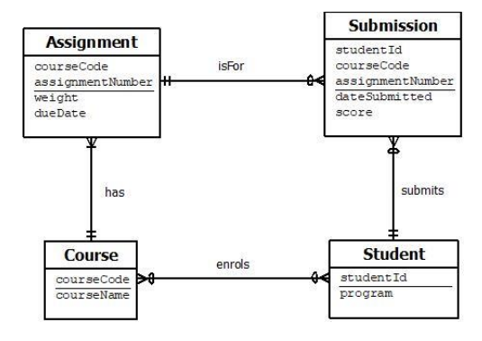

## SQL Database Project

This repository contains SQL scripts for creating and manipulating a relational database based on specified requirements. The project involves creating tables, inserting data, querying data, and writing triggers according to defined constraints and relationships.



### Introduction
The project involves:
1. **Creating Tables:** SQL scripts are written to create tables with specific columns, data types, and constraints based on the above Entity-Relationship Diagram (ERD).
2. **Populating Tables:** Data is inserted into the tables using provided datasets.
3. **Formulating Queries:** SQL queries are written to retrieve specific information from the database.
4. **Writing Triggers:** Two triggers are implemented to enforce business rules and maintain data integrity.

### Project Structure
01_create_tables.sql  
02_insert_data.sql  
03_queries_1.sql  
03_queries_2.sql  
03_queries_3.sql  
03_queries_4.sql  
03_queries_5.sql  
04_insert_trigger  
04_insert_trigger_test  
05_delete_trigger  
05_delete_trigger_test  
erd-diagram.png  
README.md  

### To Run
1. Clone the Repository:
```bash
git clone https://github.com/pravin006/student-course-rdbms.git
cd student-course-rdbms
```

2. Open Microsoft SQL Server Management Studio and create a database manually named as "Q3" or using a script:
```sql
CREATE DATABASE Q3;
GO
```

3. Execute Scripts in Order:  
    1. Run 01_create_tables.sql to create the tables.  
    2. Run 02_insert_data.sql to populate the tables with sample data.  
    3. Run 04_insert_trigger.sql and 05_delete_trigger to create the triggers.  
    4. Run 03_queries_1.sql - 03_queries_5.sql to execute the queries and view the results.  

### SQL Scripts Overview
#### Table Creation
The 01_create_tables.sql script creates the following tables:
- COURSE: Stores information about courses offered.
- ASSIGNMENT: Contains details about assignments for each course.
- STUDENT: Stores information about students.
- SUBMISSION: Records the submission of assignments by students.
- COURSE_STUDENTS: Represents the enrollment of students in courses.

Description for columns:
- studentId is a whole number starting from 1000000 with step increment 1
and is auto-generated.
- program is at most 50 characters and is one of these values: Accountancy,
Finance, Information and Communication Technology, Business
Administration.
- courseCode is exactly 5 characters starting with two letters (A-Z) followed
by 3 digits (0-9).
- courseName is at most 50 characters long.
- assignmentNumber is a running number for each course and can be
generated with a trigger.
- weight is an integer that is greater than 0,
- dueDate is a date at least one week after today’s date.
- dateSubmitted is a date with default value today’s date,
- score is a decimal number between 0 and 100.
- All columns are required except for dateSubmitted and score  

Constraints:
- enrols relationship - delete cascade and update disallowed for actions on
Student and delete/update disallowed for actions on Course.
- has relationship - delete and update cascade.
- submits relationship - delete cascade and update disallowed.
- isFor relationship - delete and update disallowed.


#### Data Insertion
The 02_insert_data.sql script inserts data into the tables. Ensure that the data complies with all constraints and formats specified during table creation.

#### SQL Queries
1. 03_queries_1: 
Program Enrollment Counts: Lists programs and the number of students enrolled, sorted by descending order of student count.
2. 03_queries_2:
Specific Student List: Retrieves students in Accounting, Business Administration, or Finance who enrolled in BS100 but did not submit assignment number 3.
3. 03_queries_3
Most Popular Programs: Identifies programs with the highest enrollment.
4. 03_queries_4
Accumulated Scores: Calculates the accumulated score for students per course, sorted by course code, accumulated score, and student ID.
5. 03_queries_5
Late Submissions: Lists students who were late more than once in submitting assignments.


#### Triggers
1. 04_insert_trigger:
Assignment Weight Trigger: Ensures that the sum of assignment weights for a course does not exceed 100 when adding a new assignment. It also auto-generates the assignmentNumber. 04_insert_trigger_test can be used to test it is working.

2. 05_delete_trigger:
Assignment Renumbering Trigger: Automatically updates the assignmentNumber of subsequent assignments when an assignment is removed. 05_delete_trigger_test can be used to test it is working.